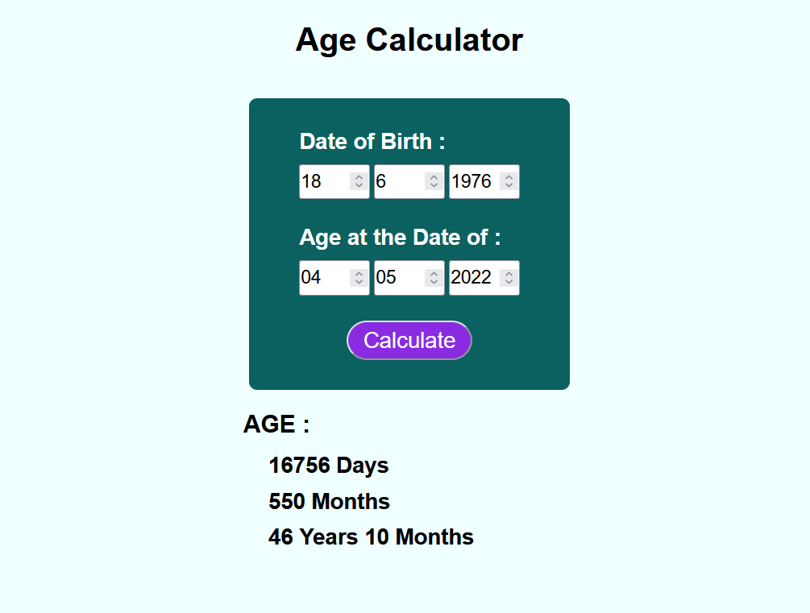

# 🧮 Age Calculator

This is a simple **Age Calculator** web application built using **HTML**, **CSS**, and **JavaScript**. It allows users to calculate the exact age between two dates in terms of **years**, **months**, and **days**.

## 🚀 Features

- Enter Date of Birth and another date to calculate age.
- Displays the result in:
  - Total Days
  - Total Months
  - Years + Months
- Clean and responsive UI.
- Built with only HTML, CSS, and JavaScript (no frameworks).

## 📸 Preview

## 🛠️ Technologies Used

- HTML5
- CSS3
- JavaScript (ES6)

